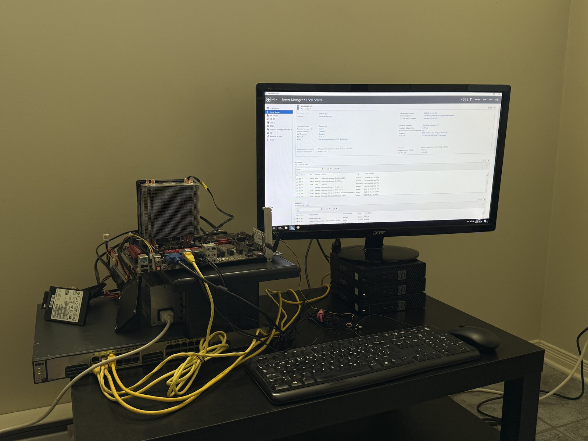
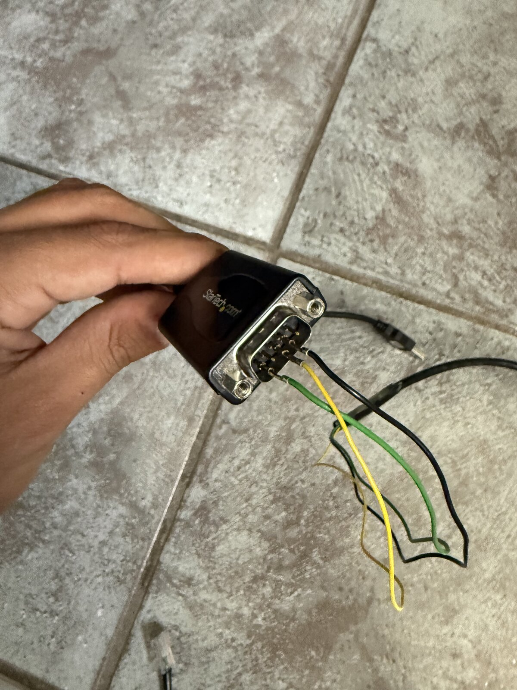
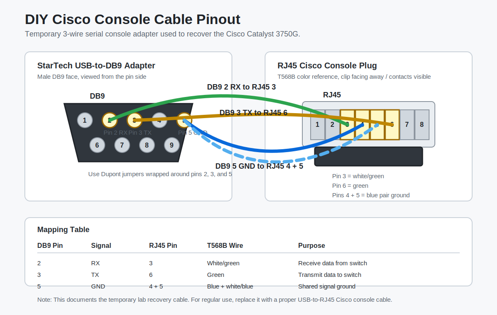

# Enterprise Infrastructure Homelab

## Overview

This repository documents an enterprise-style infrastructure homelab built from refurbished desktop hardware, a Cisco Catalyst switch, Windows Server, Proxmox VE, Ubuntu Server, Active Directory, DHCP, DNS, WDS, SSH, Docker, and clustered storage.

The purpose of the lab is to build and prove practical systems administration skills: recovering hardware, configuring switching, deploying directory services, building virtualization infrastructure, troubleshooting routing, and documenting the work in a professional format.

## Current Architecture

- Cisco Catalyst 3750G switch used as the core lab switch.
- Windows Server 2016 host used for lab infrastructure roles.
- Active Directory domain based on `corbitpros.com`.
- DNS and DHCP configured on Windows Server.
- Windows Deployment Services prepared for imaging mini PCs.
- Three Proxmox VE mini PCs clustered together.
- Ceph configured for shared lab storage.
- Ubuntu Server VM deployed inside Proxmox.
- SSH key-based authentication configured for the Ubuntu VM.
- Docker installation started on Ubuntu Server, with repository/GPG troubleshooting documented.
- Physical setup and DIY console cable photos are archived in [photos](photos/).

## Network Design

| Segment | Purpose | Example Addressing |
| --- | --- | --- |
| VLAN 1 | Initial switch management and recovery access | Existing/home-network dependent |
| VLAN 10 | Core lab/server network | `10.10.10.0/24` |
| VLAN 20 | Secondary/IoT-style test network | `10.20.20.0/24` |
| Router uplink | Internet access during build phases | Home router dependent |

The network started as a simple router-to-switch connection, then evolved into a routed lab network with Windows Server providing core infrastructure services and Proxmox hosts connected through the Cisco switch.

## Physical Build

| Homelab setup | DIY console cable |
| --- | --- |
|  |  |

Additional photos are available in [photos](photos/).

## Major Build Phases

### 1. Cisco Switch Recovery

Recovered a Cisco Catalyst 3750G from the `switch:` bootloader prompt using a temporary handmade serial console connection, PuTTY, flash inspection, BOOT variable cleanup, and manual IOS boot commands.

Documentation:

- [Cisco switch recovery](networking/cisco-switch-recovery.md)
- [Serial console access](networking/switch-console-access.md)
- [Cisco 3750G lab configuration](networking/cisco-3750g-lab.md)

### 2. Switching and VLAN Labs

Configured switch management access, restored SSH after a port/VLAN change caused a management lockout, created VLANs, assigned access ports, and began using the Catalyst switch as the core lab network device.

### 3. Windows Server Infrastructure

Installed Windows Server 2016 after newer server driver compatibility issues with an older Wi-Fi card. Configured the server for infrastructure roles including Active Directory Domain Services, DNS, DHCP, and WDS preparation.

Documentation:

- [Windows Server 2016 install](windows-server/windows-server-2016-install.md)
- [Active Directory](windows-server/active-directory.md)
- [Windows Deployment Services](windows-server/windows-deployment-services.md)

### 4. Proxmox Cluster and Ceph

Installed Proxmox VE on mini PCs, created a three-node cluster, configured the no-subscription repository path, and enabled Ceph-backed shared storage for realistic virtualization operations.

Documentation:

- [Proxmox VM inventory](proxmox/vm-inventory.md)
- [Proxmox Ceph cluster](proxmox/ceph-cluster.md)

### 5. Ubuntu Server and Secure Administration

Created an Ubuntu Server VM, fixed routing/DNS issues through the Windows Server gateway path, generated SSH keys, configured passwordless login, and hardened SSH by disabling password authentication.

Documentation:

- [Ubuntu Server VM](proxmox/ubuntu-server-vm.md)
- [Docker host setup](proxmox/docker-host.md)

## Skills Demonstrated

- Cisco console recovery and bootloader troubleshooting
- Serial pinout troubleshooting and PuTTY access
- Cisco IOS switching configuration
- VLAN planning and port assignment
- Layer 3 network troubleshooting
- Windows Server installation and driver validation
- Active Directory Domain Services
- DNS and DHCP administration
- WDS imaging preparation
- Proxmox VE installation and clustering
- Ceph shared storage fundamentals
- Ubuntu Server administration
- SSH key generation, public key deployment, and daemon hardening
- Docker repository and GPG-key troubleshooting
- Technical documentation and root cause analysis

## Repository Structure

- [networking](networking/) - Cisco switch recovery, console access, VLANs, and routing notes.
- [windows-server](windows-server/) - Windows Server install, AD DS, DNS, DHCP, and WDS notes.
- [proxmox](proxmox/) - Proxmox cluster, Ceph, VM inventory, Ubuntu Server, and Docker notes.
- [diagrams](diagrams/) - Pinout and architecture diagrams.
- [photos](photos/) - Homelab setup and DIY console cable photos.
- [hardware-inventory.md](hardware-inventory.md) - Physical equipment used in the lab.
- [troubleshooting-log.md](troubleshooting-log.md) - Issues encountered and how they were resolved.
- [lessons-learned.md](lessons-learned.md) - Practical takeaways from the build.

## Portfolio Goal

This homelab is designed to demonstrate job-ready infrastructure skills for help desk, junior systems administrator, network support, data center technician, and infrastructure operations roles.
