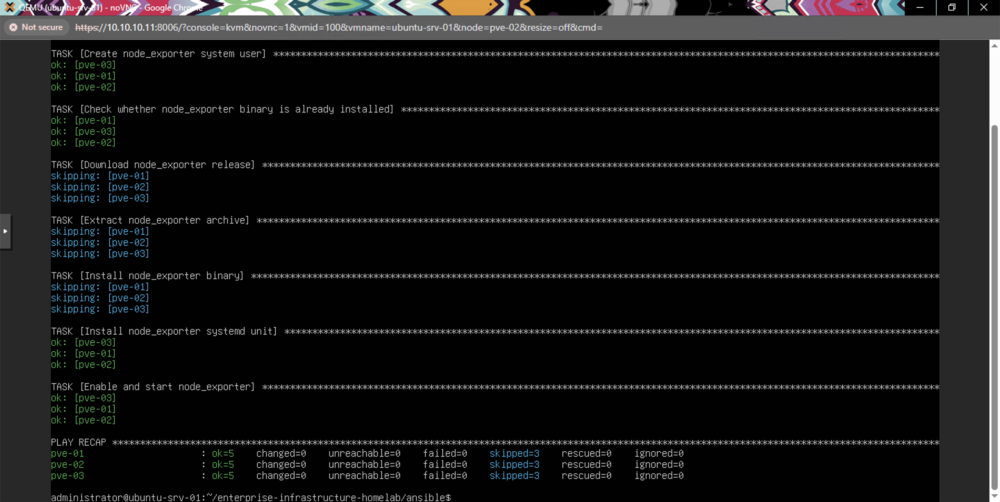

# Configuration Automation with Ansible

## Objective

Replace repetitive manual setup steps with idempotent, repeatable Ansible playbooks — starting with the `node_exporter` install that was previously done by hand, one SSH session at a time, across all three Proxmox nodes in [Monitoring and Alerting](../monitoring/monitoring-stack.md).

## Why This, and Why Now

Phase 6 involved SSHing into `pve-01`, `pve-02`, and `pve-03` individually and running the same `useradd` / `wget` / systemd unit steps three times by hand. That's exactly the kind of repetitive, error-prone toil configuration management tools exist to remove. Automating it here demonstrates the "did it manually once, then automated it" progression real infrastructure work follows.

## Control Node

The existing Ubuntu Docker host (`10.10.10.103`) serves as the Ansible control node — it's already on the lab network with working SSH, and Ansible itself is agentless (no persistent service to run), so nothing new needed to be deployed for this.

```bash
sudo apt update
sudo apt install -y ansible
```

## Inventory

[`inventory/hosts.ini`](inventory/hosts.ini):

```ini
[proxmox]
pve-01 ansible_host=10.10.10.11
pve-02 ansible_host=10.10.10.12
pve-03 ansible_host=10.10.10.13

[proxmox:vars]
ansible_user=root

[docker_hosts]
ubuntu-srv-01 ansible_connection=local
```

`ubuntu-srv-01` uses `ansible_connection=local` since it's the same machine the control node runs on — no SSH loopback needed, just local privilege escalation via `become`.

## SSH Trust to the Proxmox Nodes

The control node needs a key trusted by root on each Proxmox node:

```bash
ssh-keygen -t ed25519 -f ~/.ssh/id_ed25519 -N ""
ssh-copy-id root@10.10.10.11
ssh-copy-id root@10.10.10.12
ssh-copy-id root@10.10.10.13
```

## Playbook: `node_exporter.yml`

[`playbooks/node_exporter.yml`](playbooks/node_exporter.yml) reproduces the manual install from Phase 6, but idempotently — re-running it is a no-op once `node_exporter` is already installed and running, thanks to the `stat` check before downloading/installing:

```bash
cd ansible
ansible-playbook playbooks/node_exporter.yml
```

Unlike the original manual process, the version is pinned (`1.8.2`) as a playbook variable rather than resolved dynamically at install time — intentional, so a re-run of this playbook always produces the same result instead of picking up whatever the latest GitHub release happens to be on a given day.

## Playbook: `docker_host.yml`

[`playbooks/docker_host.yml`](playbooks/docker_host.yml) reproduces the Docker install from [Docker Host Setup](../proxmox/docker-host.md) and then brings up the monitoring stack from the cloned repo:

```bash
cd ansible
ansible-playbook playbooks/docker_host.yml --ask-become-pass
```

(`--ask-become-pass` because this one runs locally against `ubuntu-srv-01` and needs a `sudo` password rather than SSH key auth.)

## Validation

Both playbooks were run against the live environment. `node_exporter.yml` was also re-run a second time immediately after the first to confirm idempotency:



The `PLAY RECAP` shows `changed=0` across all three nodes on the second run, with the download/extract/install tasks all reporting `skipping` since `node_exporter` was already present — confirming the playbook is safe to re-run without re-downloading or restarting the service unnecessarily. Prometheus's **Status → Targets** page continued to show all `proxmox-nodes` targets `UP` throughout.

## Skills Demonstrated

- Ansible control node setup and SSH key trust distribution
- Idempotent playbook design (check-before-install patterns)
- Reproducing prior manual sysadmin work as configuration-as-code
- Ansible inventory groups, `ansible_connection=local`, and privilege escalation (`become`)
