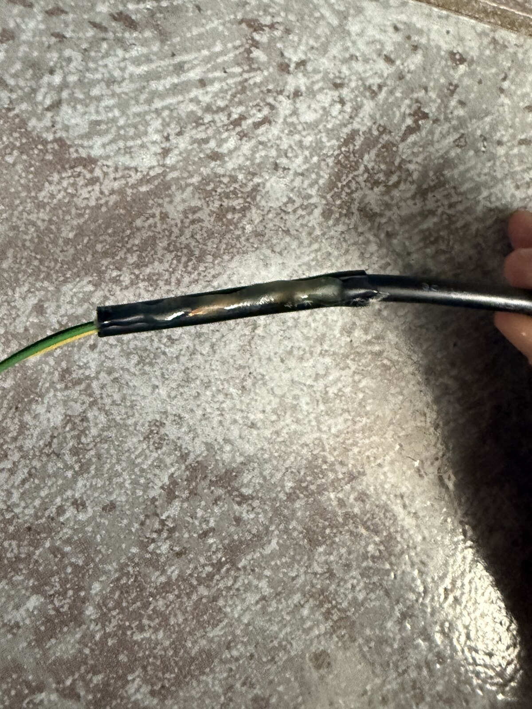
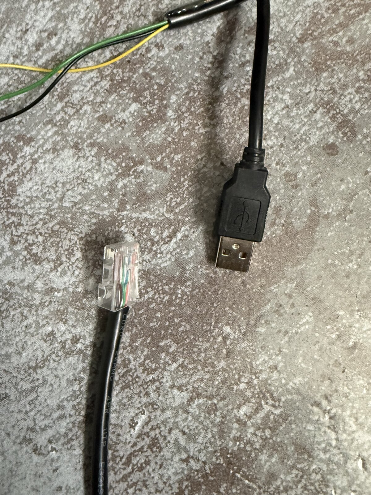
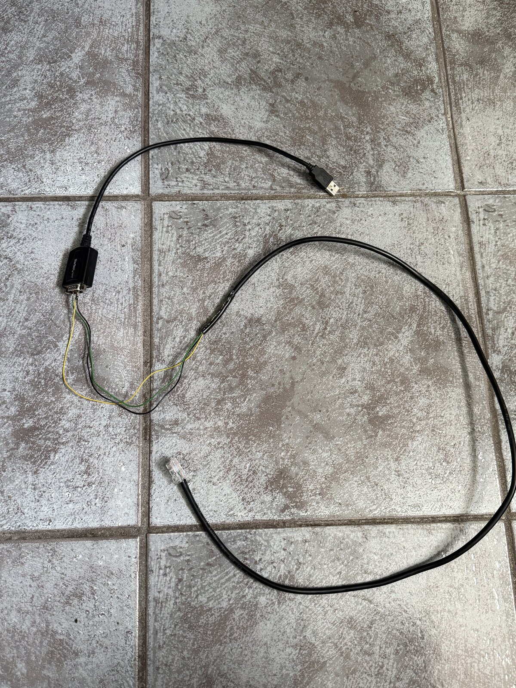

# Homelab Photos

This folder contains physical documentation of the homelab build, including the hardware setup and the temporary DIY console cable used during Cisco switch recovery.

## Preview

| Homelab setup | Console cable |
| --- | --- |
|  |  |

## Gallery

| Photo | Description |
| --- | --- |
|  | Physical homelab setup with Cisco switch, Windows Server host, and mini PCs. |
|  | Temporary console cable connected to the StarTech USB-to-DB9 adapter. |
|  | Spliced cable section wrapped and insulated. |
|  | RJ45 and USB sides of the temporary console cable. |
|  | Full temporary DIY console cable assembly. |

## Notes

- Photos are stored as JPEG files so they render directly in GitHub Markdown.
- These images document the physical side of the build, not just the logical configuration.
- The DIY console connection was used as a temporary recovery method before the switch was reusable through normal management paths.
