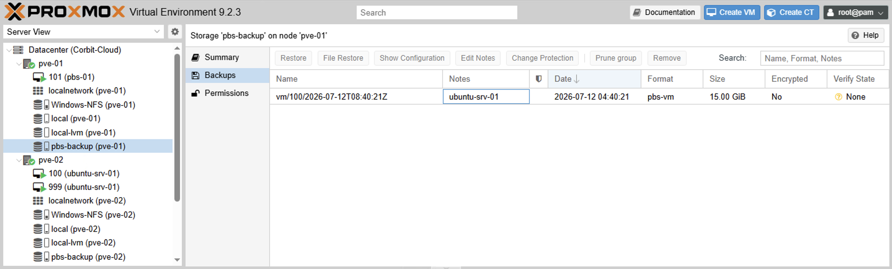
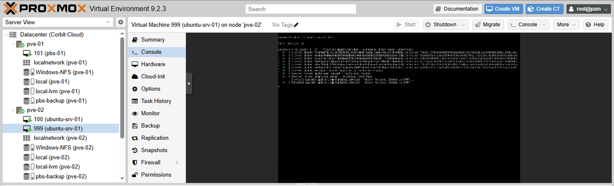

# Backup and Disaster Recovery

## Objective

Introduce real backup coverage for the Proxmox cluster using Proxmox Backup Server (PBS), including a scheduled backup job, least-privilege service account, and a validated test restore — not just a backup job that reports success.

## Architecture

```text
pve-01, pve-02, pve-03 (Proxmox VE cluster)
        |
        | Backup job (scheduled + on-demand)
        v
pbs-01 (Proxmox Backup Server VM, 10.10.10.104)
        |
        v
Datastore: backup-datastore
```

PBS runs as its own VM (`pbs-01`, VMID 101) on `pve-01` — 2 vCPU, 2 GB RAM, 32 GB disk — since Proxmox Backup Server is a separate product with its own OS, not something that runs as a container on the existing cluster nodes.

**Honest caveat:** the PBS datastore and the VMs it backs up both ultimately live on the same small cluster. This is not disaster-recovery-grade isolation — a real DR setup would put backup storage on physically separate hardware or an offsite location. What's demonstrated here is the backup/restore mechanism itself, not full site-failure resilience.

## Datastore and Access Control

A datastore (`backup-datastore`) was created on `pbs-01`, backed by a directory on its local disk.

Rather than connecting Proxmox VE to PBS using the `root` account, a dedicated service account was created with least-privilege access:

- User: `backup-svc@pbs`
- Permission: `DatastoreBackup` role scoped to `/datastore/backup-datastore` (backup/restore only, no datastore administration)

This account, along with the PBS server's TLS fingerprint, was used to register PBS as a storage target in Proxmox VE (`Datacenter → Storage → Add → Proxmox Backup Server`, ID `pbs-backup`).

## Backup Job

A scheduled backup job targets `ubuntu-srv-01` (VMID 100):

| Setting | Value |
| --- | --- |
| Storage | `pbs-backup` |
| Selection | VMID 100 (`ubuntu-srv-01`) |
| Schedule | Daily |
| Retention | Keep Last 3 |

## Troubleshooting: Backups Landing on Local Storage Instead of PBS

**Symptom:** The backup job ran and reported `OK` in the task log, but the PBS datastore showed `0 Groups, 0 Snapshots` for VMs — nothing had actually reached PBS.

**Cause:** The completed backups were `.vma.zst` files sitting on the VM's `local` storage (visible under the VM's **Backup** tab with the Storage filter showing `local`), not PBS's chunk-based format. The backup job/dialog had its **Storage** field left on the default (`local`) instead of explicitly set to `pbs-backup`.

**Resolution:** Re-ran the backup via the VM's **Backup now** dialog with **Storage** explicitly set to `pbs-backup`. The PBS **Content** tab then showed a `vm/100` backup group with a snapshot.



## Test Restore

A completed backup only proves a job ran — it doesn't prove the data is recoverable. To validate that, the `vm/100` snapshot was restored as a new VM (VMID `999`) rather than overwriting the running `ubuntu-srv-01`, then started to confirm it boots cleanly:



The restored VM completed a full systemd boot, including the Docker/containerd services from the original host, confirming the backup was a faithful, working copy. VM `999` was stopped and removed afterward to free resources on the node.

## Result

Proxmox VE is backed by Proxmox Backup Server with a scheduled job, least-privilege service account, and a confirmed working test restore — closing what was previously a total gap in the lab's infrastructure story.

## Skills Demonstrated

- Proxmox Backup Server deployment and datastore configuration
- Least-privilege service account design (dedicated backup user vs. root)
- Scheduled backup jobs and retention policy configuration
- Diagnosing a backup silently targeting the wrong storage
- Test restore validation — proving recoverability, not just job completion
