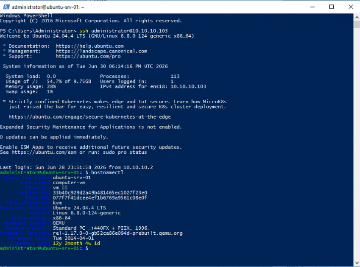
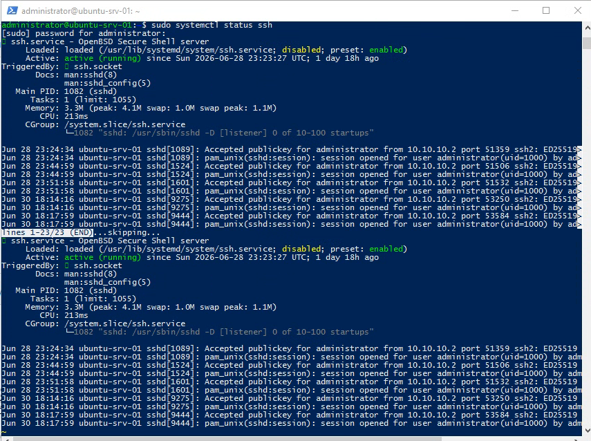

# Ubuntu Server VM

## Objective

Deploy an Ubuntu Server VM inside Proxmox and configure it as a secure Linux administration and container host.

Evidence:


## Network Context

The Ubuntu VM was connected into the lab network and required routing/DNS correction before it could access external resources reliably.

Key troubleshooting areas:

- Default gateway behavior
- Netplan configuration
- DNS nameserver selection
- Windows Server routing/NAT behavior

## SSH Key Authentication

An SSH key pair was generated from the Windows Server environment using:

```powershell
ssh-keygen -t ed25519
```

The public key was added to the Ubuntu user's `authorized_keys` file:

```bash
mkdir -p ~/.ssh
chmod 700 ~/.ssh
echo "<paste-public-key-here>" >> ~/.ssh/authorized_keys
chmod 600 ~/.ssh/authorized_keys
```

Passwordless SSH login was then verified from Windows Server:

```powershell
ssh administrator@10.10.10.103
```



## SSH Hardening

After key login worked, SSH was hardened by editing:

```bash
sudo nano /etc/ssh/sshd_config
```

Settings validated:

```text
PubkeyAuthentication yes
PasswordAuthentication no
PermitRootLogin no
```

On Ubuntu, the SSH service was restarted with:

```bash
sudo systemctl restart ssh
sudo systemctl status ssh
```

## Validation

- Confirmed passwordless login worked.
- Opened a second SSH session before closing the first session.
- Confirmed the SSH service was active.
- Confirmed standard password login was disabled after key-based access was working.



## Result

The Ubuntu Server VM became a hardened Linux administration target suitable for Docker and future service hosting.
