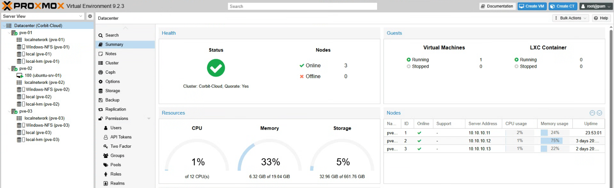

# Windows NFS Shared Storage

## Objective

Provide shared storage to the Proxmox cluster using a Windows Server NFS export backed by pooled SSD storage.

## Current State

- Ceph was disabled for the current lab design.
- Three SSDs are pooled on the Windows Server storage host.
- The pooled storage is exported through Windows NFS.
- The Proxmox nodes mount the shared storage as `Windows-NFS`.
- The Proxmox cluster remains active with three online nodes.

Evidence:



## Why Windows NFS

This layout fits the current hardware better than Ceph because the SSDs are attached to the Windows Server system instead of being distributed across the Proxmox nodes as dedicated Ceph OSD disks.

The design still demonstrates practical infrastructure skills:

- Windows storage pooling
- NFS export configuration
- Proxmox shared storage integration
- Centralized storage for clustered virtualization
- Storage design tradeoff analysis

## Architecture

```text
Windows Server pooled SSD storage
        |
        | NFS export
        v
Proxmox storage target: Windows-NFS
        |
        +-- pve-01
        +-- pve-02
        +-- pve-03
```

## Notes

Ceph is still valuable to learn later, but Windows NFS is the accurate storage design for the current state of this homelab.
