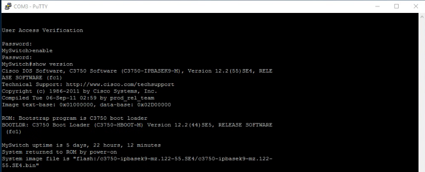
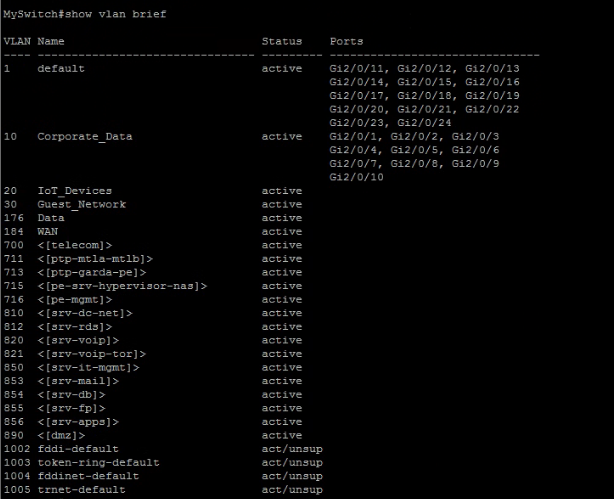
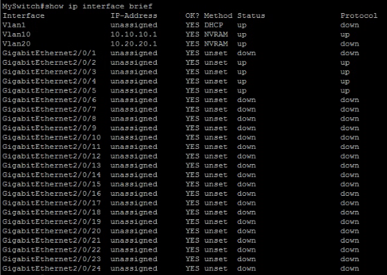
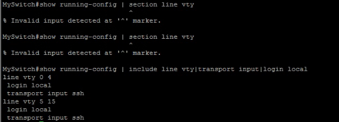
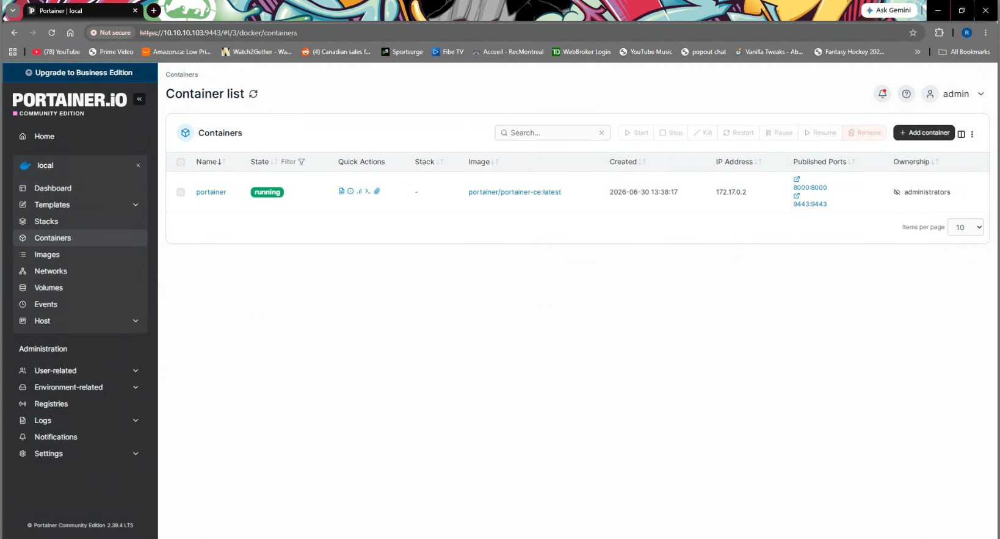

# Screenshot Evidence

This folder contains validation screenshots for the homelab build.

## Gallery

### Cisco Switching

| Screenshot | Evidence |
| --- | --- |
|  | Cisco Catalyst 3750 IOS and boot image validation. |
|  | VLANs including `Corporate_Data`, `IoT_Devices`, `Guest_Network`, and `WAN`. |
|  | SVI addressing for VLAN 10 and VLAN 20. |
|  | VTY lines configured for `login local` and `transport input ssh`. |

### Windows Server

| Screenshot | Evidence |
| --- | --- |
|  | Windows Server roles installed and manageable. |
|  | Domain controller object under `lab.corbitpros.com`. |
|  | AD-integrated DNS zones. |
|  | Active DHCP scope for `10.10.10.0`. |
|  | Windows Deployment Services configured in native mode. |

### Proxmox, Linux, and Docker

| Screenshot | Evidence |
| --- | --- |
|  | `Corbit-Cloud` Proxmox cluster with three online nodes. |
|  | Ubuntu Server VM running on Proxmox. |
|  | SSH login to `ubuntu-srv-01` and Ubuntu host details. |
|  | SSH service active and accepting public key sessions. |
|  | Docker and Portainer running on the Ubuntu server. |
