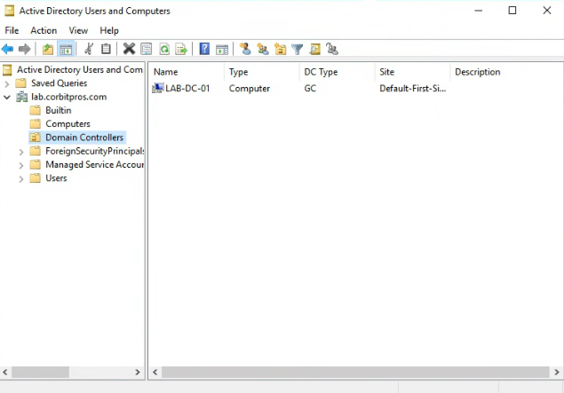
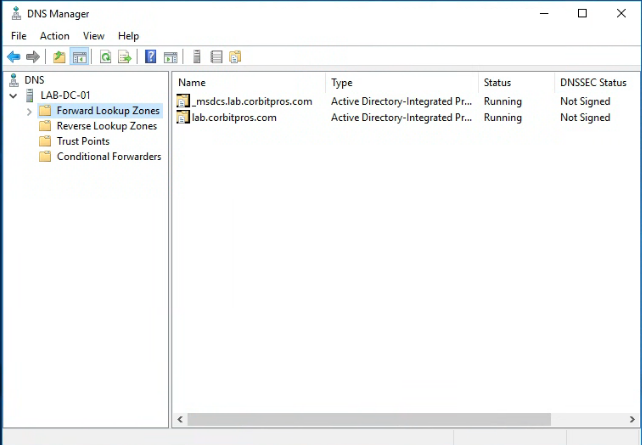
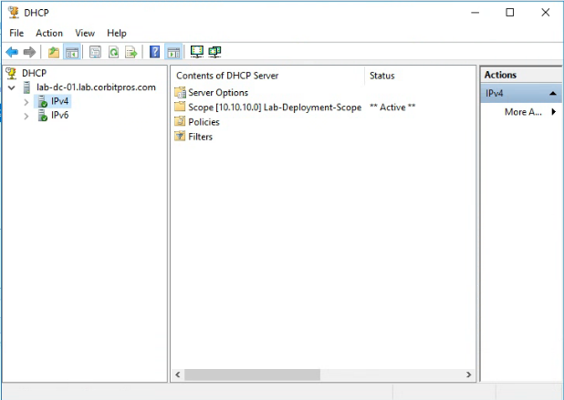
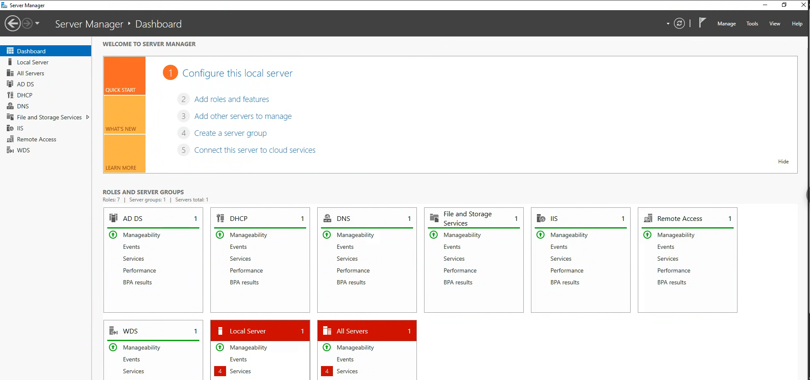

# Active Directory, DNS, and DHCP

## Objective

Configure Windows Server 2016 as the central identity, DNS, and DHCP server for the homelab.

## Domain

| Item | Value |
| --- | --- |
| Domain | `corbitpros.com` |
| AD DNS name shown in consoles | `lab.corbitpros.com` |
| Server role | Domain controller / infrastructure server |
| Lab network | `10.10.10.0/24` |

## Active Directory

Active Directory Domain Services was selected to provide centralized identity management and a realistic enterprise administration layer.

Portfolio talking points:

- Installed AD DS role.
- Promoted Windows Server to a domain controller.
- Established a named lab domain.
- Prepared the environment for domain-joined clients and servers.

Evidence:

## DNS

DNS was configured as part of the domain controller build so lab clients and servers can resolve domain resources.

Key purpose:

- Resolve `corbitpros.com` domain resources.
- Support AD DS service discovery.
- Provide consistent name resolution for lab infrastructure.

Evidence:

## DHCP

DHCP was configured to provide addressing for lab-connected systems.

Troubleshooting note:

- DHCP did not initially appear as expected.
- The server was checked in the authorized DHCP servers list.
- It was already authorized, and the DHCP console began showing it correctly afterward.

Evidence:

## Validation

Validation steps used during the lab:

- Checked DHCP authorization.
- Confirmed server visibility in management consoles.
- Verified switch-to-server connectivity.
- Confirmed lab clients could be prepared for addressing and deployment work.

## Result

The Windows Server host now acts as the foundation for centralized infrastructure services in the homelab.

