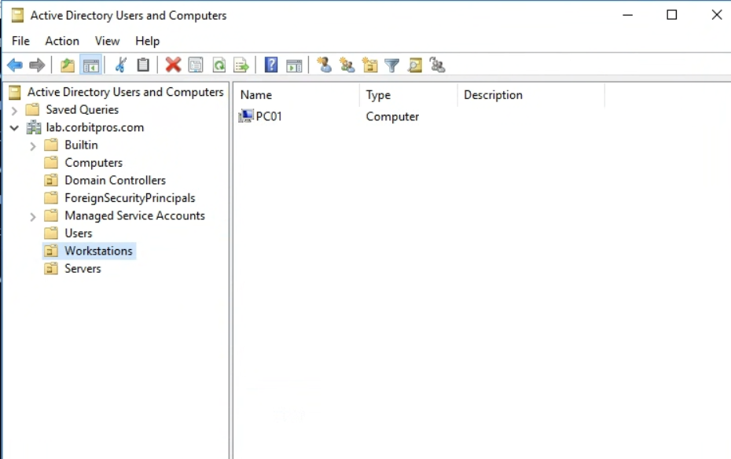
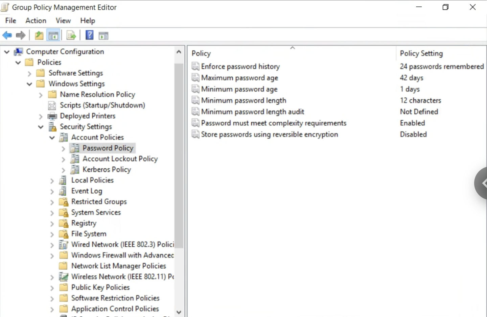
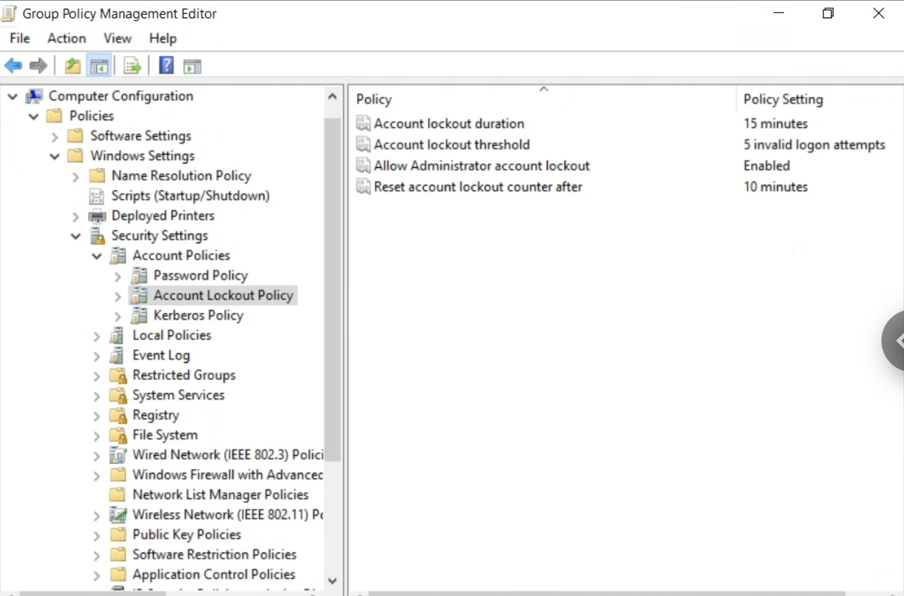
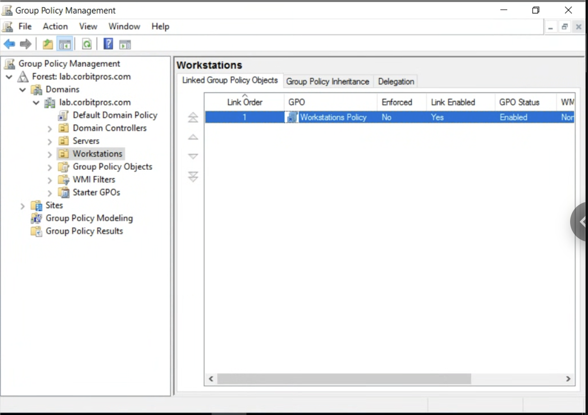
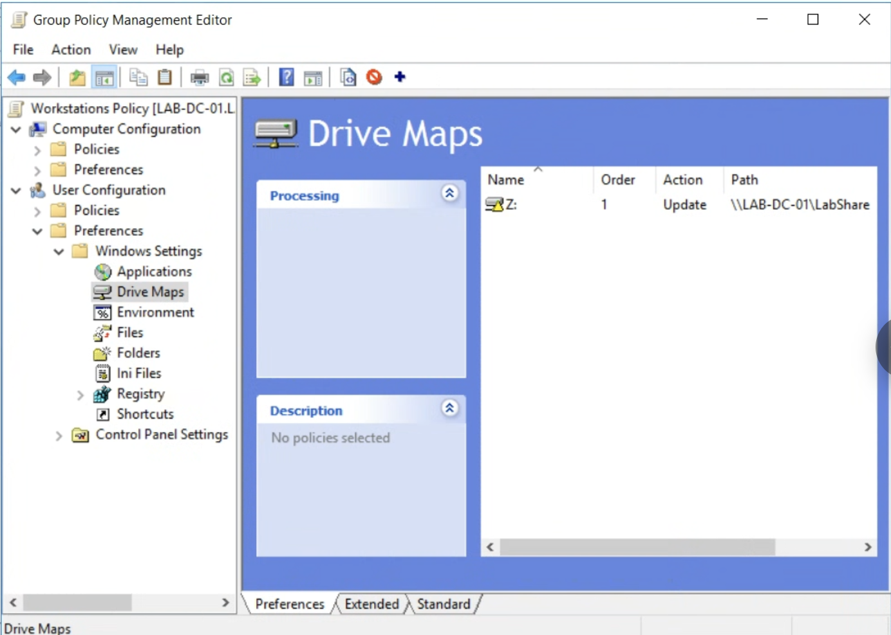
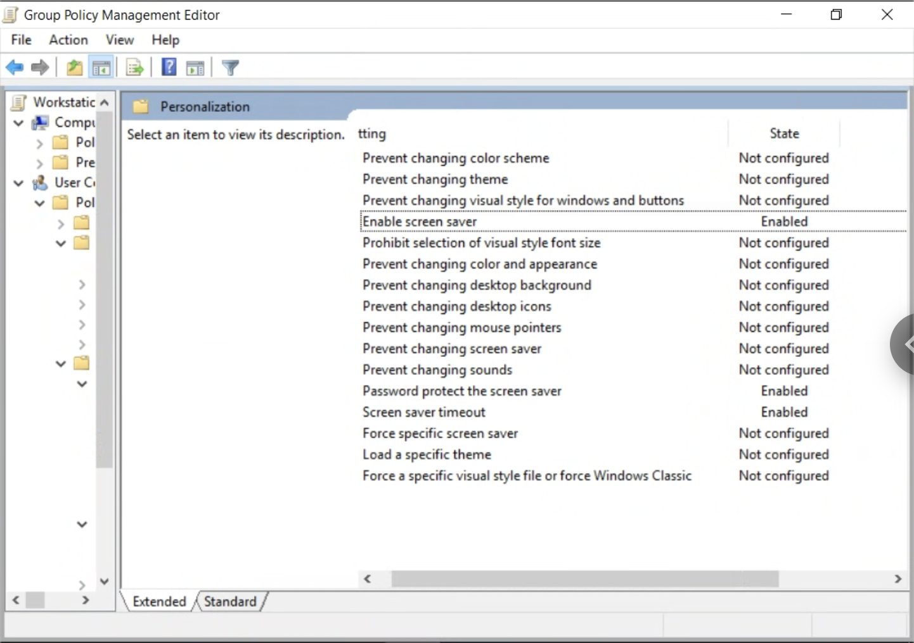
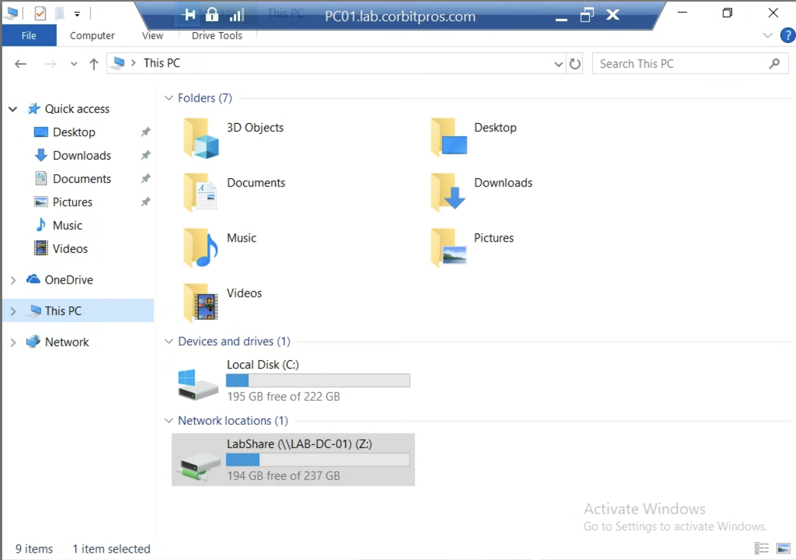

# Organizational Units and Group Policy

## Objective

Introduce OU-based structure and Group Policy management for the `lab.corbitpros.com` domain, starting with a domain-joined Windows 10 client imaged through WDS.

## Client Provisioning

A Windows 10 image already staged in WDS was PXE-booted onto a spare mini PC. The unattended install joined the machine to the domain automatically, landing the computer object in the default `Computers` container.

## OU Design

```text
lab.corbitpros.com
├── Workstations
└── Servers
```

- `Workstations` holds domain-joined client machines (e.g. `PC01`), so workstation-scoped GPOs (password policy, drive mapping, hardening) have a clean link target.
- `Servers` is created for future member servers. Domain Controllers are intentionally left in their default `Domain Controllers` OU rather than moved.

The default `Computers` container is not an OU, so anything left there cannot receive OU-linked Group Policy — this is why new computer objects need to be relocated after joining.

## PowerShell Commands Used

Run on the domain controller, elevated, with the Active Directory module loaded:

```powershell
New-ADOrganizationalUnit -Name "Workstations" -Path "DC=lab,DC=corbitpros,DC=com"
New-ADOrganizationalUnit -Name "Servers" -Path "DC=lab,DC=corbitpros,DC=com"
```

Find the newly domain-joined client sitting in the default container:

```powershell
Get-ADComputer -Filter *
```

Move it into `Workstations`:

```powershell
Move-ADObject -Identity "CN=PC01,CN=Computers,DC=lab,DC=corbitpros,DC=com" `
  -TargetPath "OU=Workstations,DC=lab,DC=corbitpros,DC=com"
```

Verify the move:

```powershell
Get-ADComputer -Identity "PC01" | Select-Object Name, DistinguishedName
```

## Evidence



`Workstations` and `Servers` OUs created at the domain root, with `PC01` (the WDS-imaged Windows 10 client) relocated into `Workstations`.

## Domain-Wide Account Policies

Windows only honors Account Policies (password policy, account lockout policy) from a GPO linked at the **domain root** — a GPO linked to an OU only affects the local SAM accounts on machines in that OU, not domain logons. This is a common point of confusion, so rather than scoping these to `Workstations`, they were configured directly on **Default Domain Policy**.

Password Policy:

| Setting | Value |
| --- | --- |
| Enforce password history | 24 passwords remembered |
| Maximum password age | 42 days |
| Minimum password age | 1 day |
| Minimum password length | 12 characters |
| Password must meet complexity requirements | Enabled |
| Store passwords using reversible encryption | Disabled |



Account Lockout Policy:

| Setting | Value |
| --- | --- |
| Account lockout duration | 15 minutes |
| Account lockout threshold | 5 invalid logon attempts |
| Allow Administrator account lockout | Enabled |
| Reset account lockout counter after | 10 minutes |



## Workstations Policy GPO

A separate GPO, `Workstations Policy`, was created and linked to the `Workstations` OU for settings that are correctly scoped at the OU level (unlike Account Policies above).



### Drive Mapping

Before the drive map, a file share was created on the domain controller:

```powershell
New-Item -Path "C:\LabShare" -ItemType Directory
New-SmbShare -Name "LabShare" -Path "C:\LabShare" -FullAccess "Everyone"
icacls "C:\LabShare" /grant "Authenticated Users:(OI)(CI)M"
```

Share permissions are left open (`Everyone: Full Control`) with the actual restriction enforced at the NTFS layer (`Authenticated Users: Modify`) — the standard share/NTFS permission split.

`Workstations Policy` → `User Configuration → Preferences → Windows Settings → Drive Maps` maps `Z:` to `\\LAB-DC-01\LabShare`:



### Hardening: Screensaver Lock

`Workstations Policy` → `User Configuration → Policies → Administrative Templates → Control Panel → Personalization`:

| Setting | Value |
| --- | --- |
| Enable screen saver | Enabled |
| Password protect the screen saver | Enabled |
| Screen saver timeout | Enabled |

Note this lives under **User Configuration**, not Computer Configuration — screensaver behavior is a per-user desktop setting, so it isn't found under Computer Configuration's Personalization node.



## Troubleshooting: User Settings Not Applying

Initial validation with `gpresult /r` showed `Workstations Policy` applied under **COMPUTER SETTINGS**, but **USER SETTINGS** showed no GPOs applied at all (`N/A`) — meaning the drive map and screensaver policy, both `User Configuration` settings, were never reaching the logged-in user.

**Cause:** `User Configuration` settings apply based on which OU the *user object* lives in, not which OU the computer lives in. `LAB\Administrator`'s account lives in the default `Users` container (`CN=Administrator,CN=Users,DC=lab,DC=corbitpros,DC=com`), not in `Workstations` — so even though `PC01` (the computer) is correctly placed in `Workstations`, the GPO's user-side settings were never evaluated for a user object outside that OU.

**Fix:** Enabled Group Policy Loopback Processing on `Workstations Policy` so user-side settings are applied based on the *computer's* OU instead of the user's:

- `Workstations Policy` → `Computer Configuration → Policies → Administrative Templates → System → Group Policy` → **"Configure user Group Policy loopback processing mode"** → Enabled, mode **Merge** (keeps the user's own GPOs in addition to `Workstations Policy`, rather than replacing them).

After `gpupdate /force` and a fresh `gpresult /r`, `Workstations Policy` appeared in both the Computer Settings and User Settings applied lists:

```text
COMPUTER SETTINGS
Applied Group Policy Objects
-----------------------------
    Workstations Policy
    Default Domain Policy

USER SETTINGS
Applied Group Policy Objects
-----------------------------
    Workstations Policy
```

## Validation

The `Z:` drive mapping appeared correctly under Network locations on `PC01`:



## Next Steps

- Confirm the screensaver lock triggers after the configured timeout on `PC01`.
