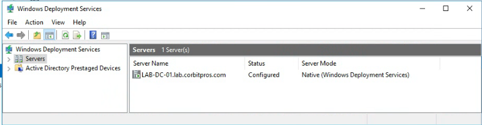

# Windows Deployment Services

## Objective

Prepare Windows Deployment Services (WDS) so the lab can image multiple mini PCs from a centralized Windows Server instead of installing each machine manually.

## Reason for WDS

The lab includes multiple mini PCs. WDS turns repeated manual installs into a repeatable deployment workflow and demonstrates practical endpoint provisioning skills.

## Planned Workflow

1. Install the WDS role on Windows Server 2016.
2. Configure WDS for integrated Active Directory operation.
3. Create an image group, such as `Windows_10_Enterprise`.
4. Add boot images from Windows installation media.
5. Add install images when ISO media is available.
6. PXE boot mini PCs from the lab network.
7. Deploy Windows images over the network.

## Current Status

- WDS role was installed and configured.
- Server `LAB-DC-01.lab.corbitpros.com` appears in WDS as configured.
- Server mode is native Windows Deployment Services.
- A Windows 10 boot image was added and staged for PXE deployment.
- A spare mini PC was PXE-booted against WDS and imaged end to end.
- The imaged client auto-joined the `lab.corbitpros.com` domain during the unattended install.

Evidence:



## PXE Boot and Client Imaging

The target mini PC was set to PXE boot and picked up the Intel Boot Agent handshake against the WDS server:

```text
CLIENT IP: 10.10.10.100   DHCP IP: 10.10.10.2   GATEWAY IP: 10.10.10.1
Downloaded WDSNBP from 10.10.10.2 LAB-DC-01.lab.corbitpros.com
```


The Windows 10 image deployed and the unattended install joined the machine to the domain automatically, without a manual domain-join step.

## Post-Imaging Cleanup

The client's default computer name didn't match the naming convention used for the lab, so it was renamed to `PC01` after imaging. Renaming a domain-joined machine leaves the DNS record pointing at the old name until it's refreshed, which blocked it from being found cleanly for the OU move described in [Organizational Units and Group Policy](group-policy.md).

Resolved by running, on the client, after the rename and reboot:

```powershell
ipconfig /flushdns
ipconfig /registerdns
```

This cleared the stale local resolver cache and forced the client to re-register its `A` record in DNS under its new name, after which the computer object was visible and correctly named for the `Move-ADObject` step into the `Workstations` OU.

## Skills Demonstrated

- Enterprise imaging concepts
- PXE deployment planning and execution
- Unattended install with automatic domain join
- Centralized endpoint provisioning
- DNS record troubleshooting after a computer rename
- Windows Server role planning
- Repeatable infrastructure documentation
